> **<u>Project Name</u>**
>
> **<u>Cybersecurity – Networking Project</u>**
>
> **<u>Task 1: Introductions To Networking Security Basics.</u>**
>
> **Q-1.** **What** **Is** **Network** **Security?**

**Ans**: Protecting data as it moves **across** **devices** **and**
**networks** from unauthorized access, misuse, or disruption.

> • Endpoint’s (Computers, Phones, Servers, Etc)
>
> • Network Devices (Routers, Switches, Firewalls, Etc)
>
> **Q-2.** **What** **Are** **Network** **Threats?**

**Ans**: Dangers to a network's integrity, confidentiality, or
availability, ranging from Malware and phishing to sophisticated attacks
like DDoS and SQL injection.

Here’s Few Common Network Threats as Below.

> • **Malware**: Malware is not a virus it’s a malicious Software Code.
>
> • **Virus**: It is a malicious Code which is spread in network and
> system when executed by User.
>
> • **Worm**: It’s a Malware code its self-replicating automatically
> across the networks without user Action.
>
> • **Trojans** **Horse**: it’s a malware software it’s like secure but
> it opens backdoor for hackers.
>
> • **Phishing**: It is a Social EngineeringAttack when Users Are
> Tricked into revealing Credentials or Installing Malware. Ex Emails.
>
> • **Ransome** **Ware**: Encrypts User Data and Demanding Ransome for
> Data Decrypt.
>
> • **DDos**: Create Huge Traffic on particular server which server
> isn’t used by anyone.
>
> **Q-3.** **Threat** **Identifications.**

**Ans**: We can find threat and identify via real time monitoring with
security tools Like SEIM, behaviors Analysis, threat Hunting,

> **Q-4.** **What** **is** **Firewall?**
>
> **Ans**: Firewall is Cybersecurity Tools Which Is Used for Managing
> Incoming and Outgoing Traffic As per Pre-Defined Rules.
>
> We have so many types of firewalls. Likes WAF, Next-Gen-Firewall.
> PocketFilterFirewall. Hardware firewall & Software Firewall.
>
> **Q-5.** **What** **is** **Encryption?**

**Ans**: Encryptions is the process of the Converting readable data into
unreadable format. It called cipher-text. To protect our data from
unauthorized access.

> • Ex: plain text converting to ciphertext. Encryptions to decryptions.
>
> **Q-6.** **What** **are** **the** **secure** **Network**
> **Configurations?**

**Ans**: Secure network configurations mean implementing some policy in
your organizations for reducing some Attacks and unauthorized access.

> **Ex.**
>
> • Password Policy: change the password every 30 days. • Firmware:
> update the firmware in router.
>
> • Systems: update your Every Systems.
>
> Configure Firewall: Enable and properly configured firewall to filter
> traffic and block unauthorized access.
>
>**<u>Q-7. Enable and configure a basic firewall (e.g., Windows
> Defender Firewall) to</u>** **<u>block unauthorized access.</u>**
>
> **Ans:**
>
> 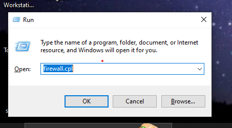 style="width:4.71875in;height:2.60417in" />• Open \>Control Panel \>
> System And Security \> Windows Defender Firewall. \[Win+R \>And Type
> Firewall.cpl\]
>
> • Ensure firewall is *on* for both Private and Public networks.

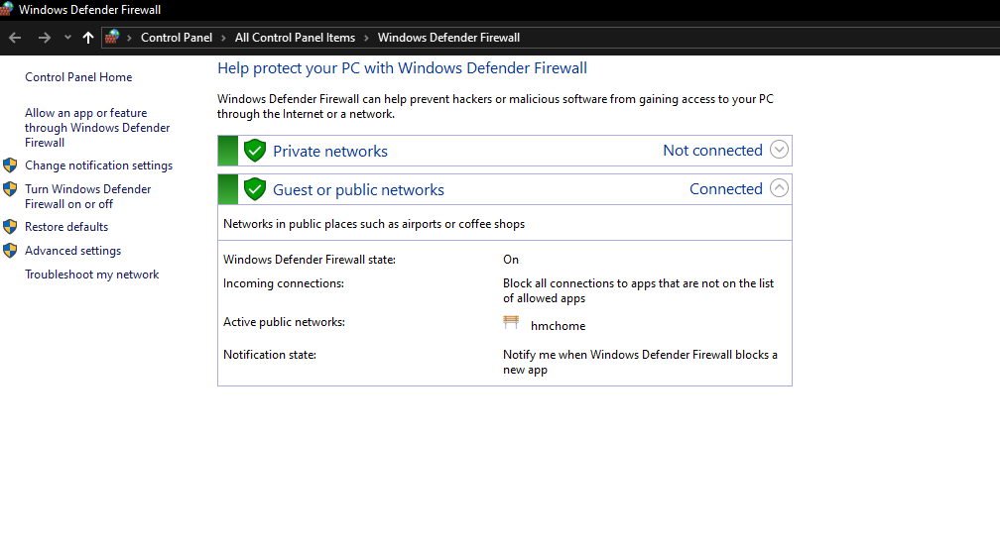

> • On the left, click **Advanced** **settings** **→** **Inbound**
> **Rules**.
>
> 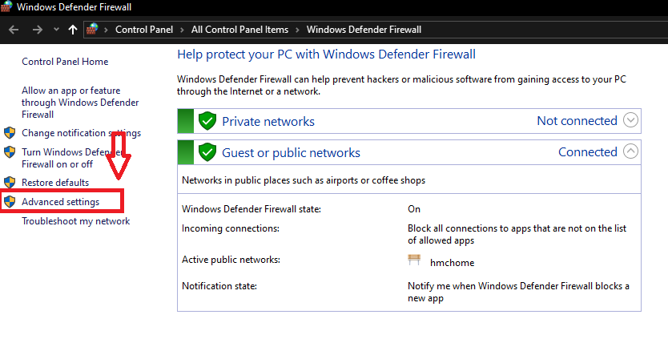 style="width:6.49583in;height:3.41736in" />• Click On Advanced
> Settings.

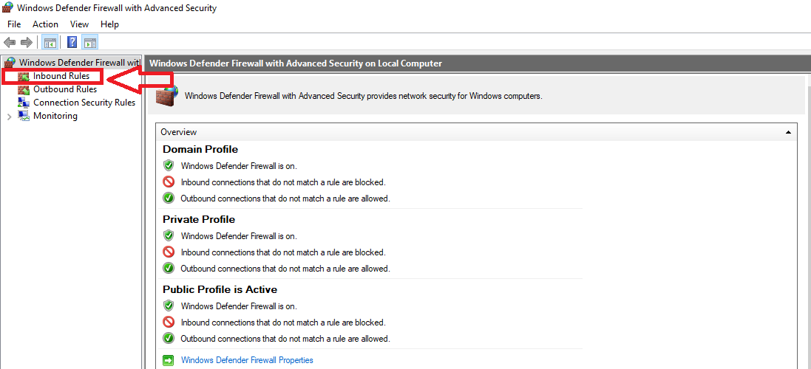

> • Click On Inbound Rules.
>
> • Block unnecessary ports:
>
> Example: Create a new rule to **block** **inbound** **TCP** **port**
> **23** **(Telnet)**. Steps: -
>
> 1\) Right Side Click On “New Rules”. 2) Select The Port.
>
> 3\) Next.

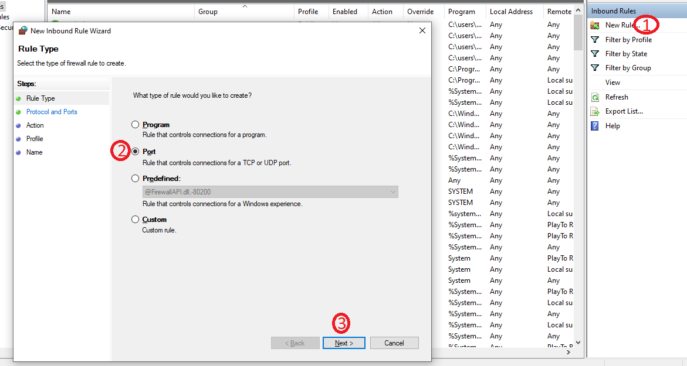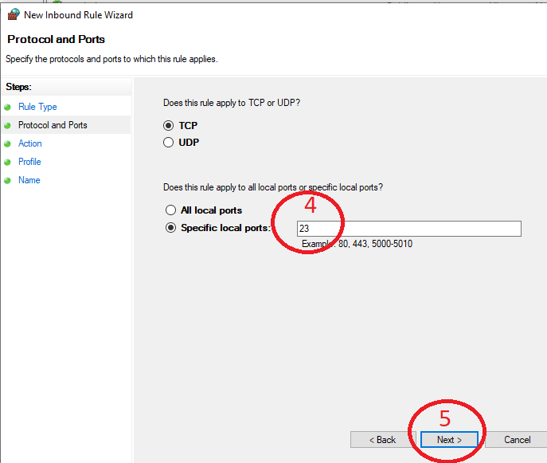

> 4\) Enter The Port Number 23. 5) Next.
>
> 6\) Select The Block The Connection. 7) Next.

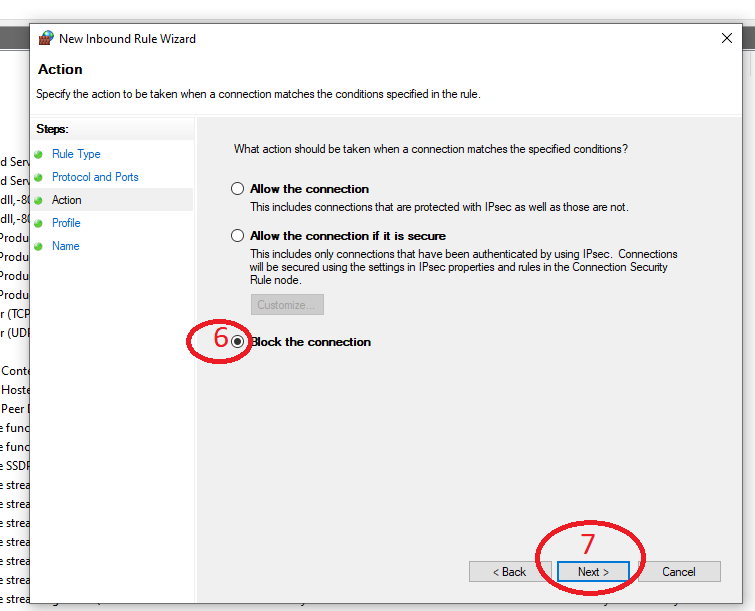

>  style="width:5.71111in;height:2.9125in" />• Select All Profile Domain,
> Private, Public. 8) Next.

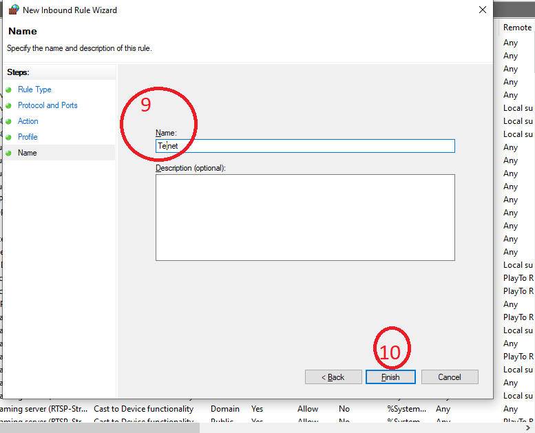

> 9\) Give Name: Telnet 10)Next.

**<u>Q-8. Monitor Network Traffic.</u>**

**<u>o Use Wireshark to capture and analyze network traffic.</u>**

**<u>o Identify different types of traffic, such as HTTP, DNS, and
others, and</u>** **<u>understand what they mean.</u>**

**<u>o Learn how to spot unusual or suspicious traffic that might
indicate a security</u>** **<u>threat.</u>**

**Ans**: For Wireshark We Can Use Both OS. Like Windows & Linux.

But Here WeAre Using Kali Linux We Had Setup On VM.

Open Wireshark On kali Linux.

Then Select Lan Adaptor Options: “eth0”And Its Start For Capturing
Network Traffic.

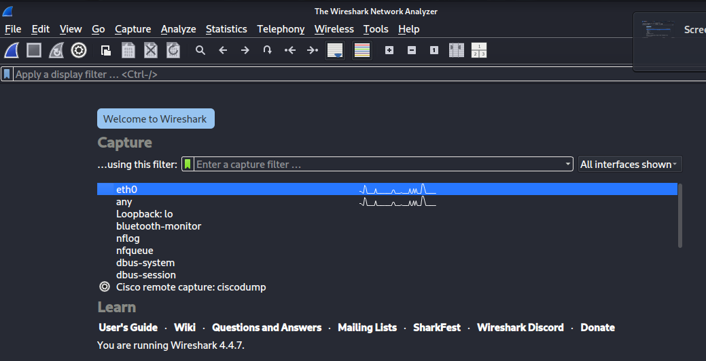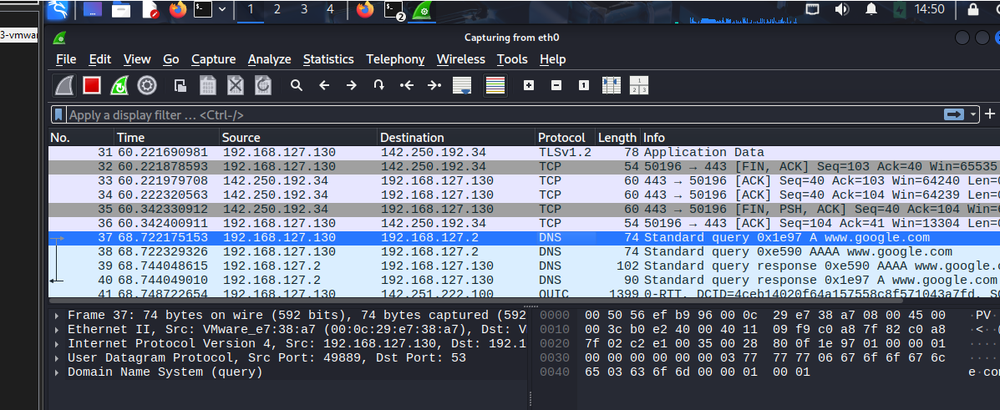

> • DNS Traffic.
>
> 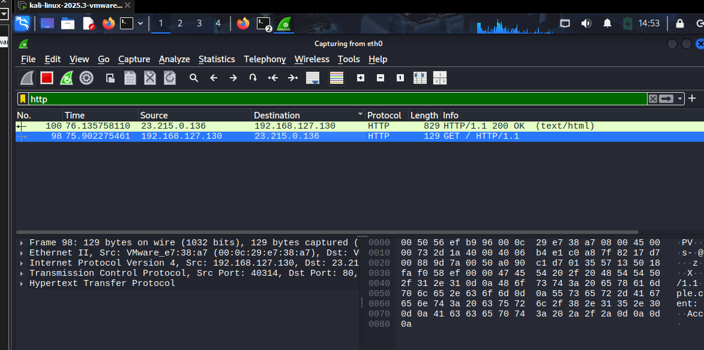 style="width:6.09514in;height:2.8775in" />• HTTP Traffic.
>
> 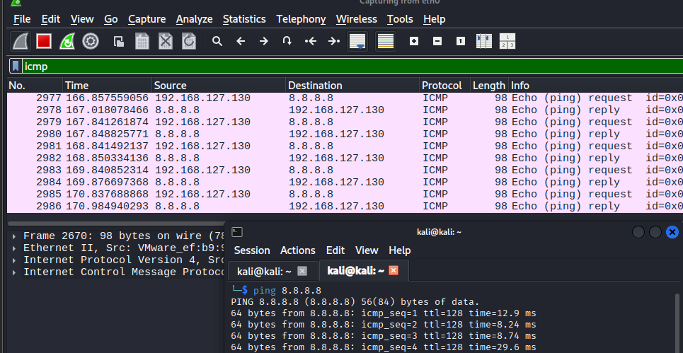 style="width:5.69458in;height:2.32153in" />• ICMP Traffic.
